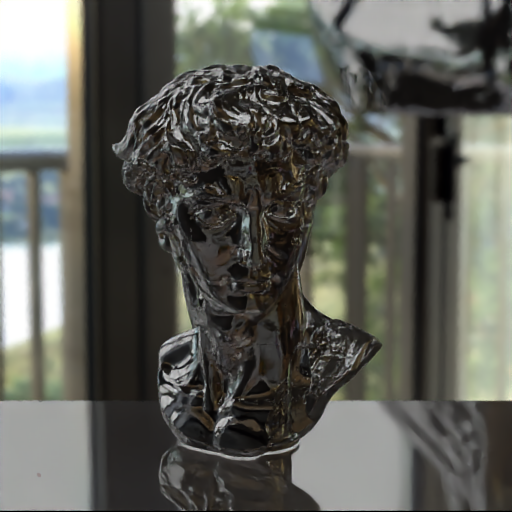
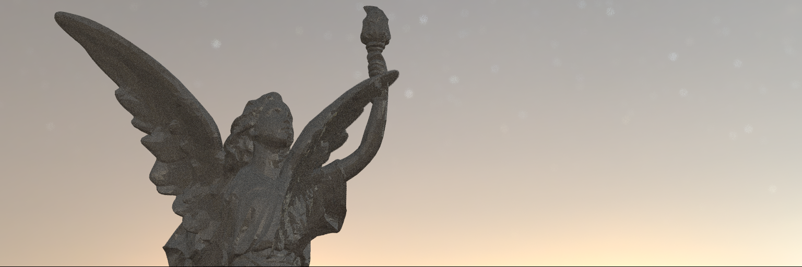
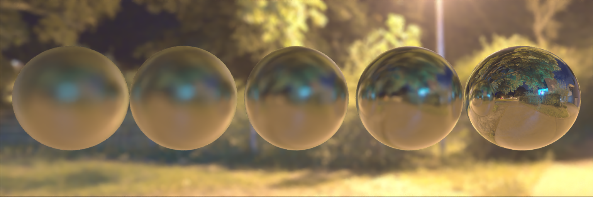
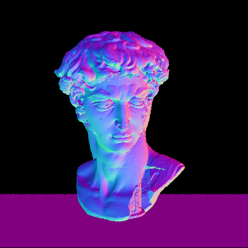
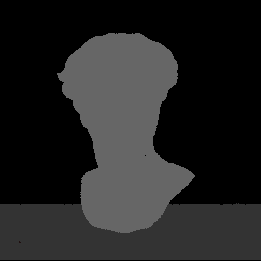

# Physically Based Path Tracer 
The below 3D model for the *Head of Michelangelo's David* bust was taken from [here](https://www.myminifactory.com/object/3d-print-head-of-michelangelo-s-david-52645). Other `.obj` models taken from [The Stanford 3D Scanning repository](http://graphics.stanford.edu/data/3Dscanrep/)
|:-------------------------:|

  <kbd>
    
    
    
  </kbd>

This repository contains the implementation of a physically based monte carlo path tracer in C++. The project avoids the use of graphics API's and attempts to implement simple physically based rendering effects from scratch. 

This is a project I essentially come to in my free time and is something I intend to update sporadically. If you have read the code, or tried to create a scene and have found any flaws or errors in the way things have been done — do feel free to leave an issue! 

## Feature Tracker / To Do 
- [x] Motion Blur 
- [x] Antialiasing
- [x] Depth of Field
- [x] Bounding Volume Heirarchies 
- [x] Multithread pixel processing
- [x] Add `.obj` object support   
- [x] Importance Sampling 
- [x] HDR Environment maps
- [ ] ~~Find a way to serialize BVH tree object (for re-use for large meshes)~~ 
- [x] Optimize and Multithread mesh BVH tree building 
- [ ] ~~Optimize ray-triangle intersection routine~~ 
- [x] Implement additional BSDF's (Disney BSDF) and materials (sort of?)
- [ ] ~~Incorporate CUDA, get full rendering to happen on GPU~~

On halt for now, spending too much time on this 

## Denoiser 

Noisy Render (Output)             |  Normal map | Albedo map | Denoised Image
:-------------------------:|:-------------------------:|:-------------------------:|:-------------------------:
  |   |  |  

Since the application runs on the CPU, samples per pixel needs to be limited to obtain reasonable render times (even with multi-threading). 

The images shown above are denoised using [Intel® Open Image Denoise](https://www.openimagedenoise.org/). The pre-compiled zip file from their website (unzipped, includes a `bin` and a `lib` folder) needs to be moved into `src/dependancies/`, for the shell script `denoise` to work. 

## Usage

  <kbd>
    
    
  </kbd>

A sample binary has been uploaded with the repo (compiled on x86, as a 64 bit application), but its unlikely that it would generally work even on a system with the same configuration (try anyway, it just might). 

`CMakeLists.txt` is given and the project can easily be compiled using the cmake build system.

    mkdir build && cd build 
    cmake .. 
    make

After compiling the project, the compiled binary (`path-tracer`) can be found in the `bin/` directory and is to be used with a single command line argument - the name of the scene in `src/scenes/`. (The folder `src/scenes/` contains implementation of all the scenes in this readme file)

    ./bin/path-tracer GlowRoom

Running this should show a progress bar, after which 3 images will be stored in `output/noisy_render`, `output/albedo_maps`, and `output/normal_maps`. After these three images have been generated, the `denoise` shell script can be run to denoise the image 

    ./bin/denoise GlowRoom

The resolution of the output render and the samples per pixel have been hard-coded in `main.cpp`

## Dependancies 

* `OpenMP` was used for multi-threading the ray shooting and BVH tree building. 
* ([stb_image](https://github.com/nothings/stb) and [FreeImage](https://freeimage.sourceforge.io/)) were used to handle images. 
* [GLM](https://github.com/g-truc/glm) was used for mathematical data types (vectors, matrices, etc.) and operations. 
* [ImageMagick](https://github.com/ImageMagick/ImageMagick) is required for conversions in the `denoise` shell script.

## Resources

This project takes a lot from Ravi Ramamoorthi's course - [An intro to graphics](https://www.edx.org/course/computer-graphics-2); and the repository and code largely takes its structure and features from [Peter Shirley's book series](https://raytracing.github.io/).

The Disney BSDF, though poorly incorporated and incomplete, takes a lot from [this repository](https://github.com/schuttejoe/Selas) and the corresponding [blog articles](https://schuttejoe.github.io/post/disneybsdf/). Inspiration was also taken, but to a lesser extent from [tinsel from mmacklin](https://github.com/mmacklin/tinsel) and [GLSLPathTracer from knightcrawler25](https://github.com/knightcrawler25/GLSL-PathTracer).  

And just like everyone ever who has written a path tracer, constant references were made to [Physically Based Rendering by *Matt Pharr, Wenzel Jakob, and Greg Humphreys*](https://www.pbr-book.org/) and its [repository](https://github.com/mmp/pbrt-v3). 

## Note 
This was more or less a pet project to be able to learn the fundamental basics of path tracing, and with every feature I added, I ended up wanting to add more.  

I have licensed this project under the Zlib license, and do what you may with the code but I would highly recommend not to re-use the `bsdf` namespace and the `core::Disney` class, since some of the lobe calculations are off. 
