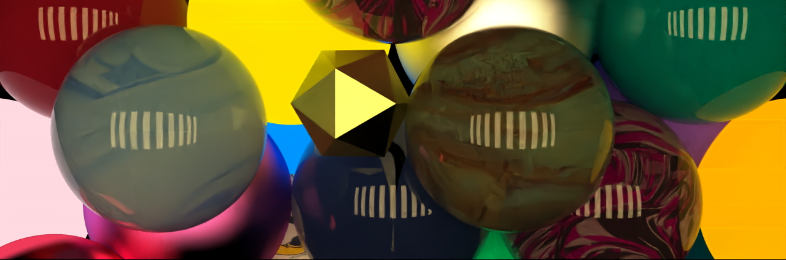
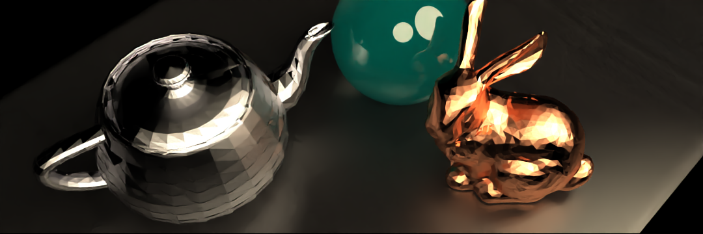
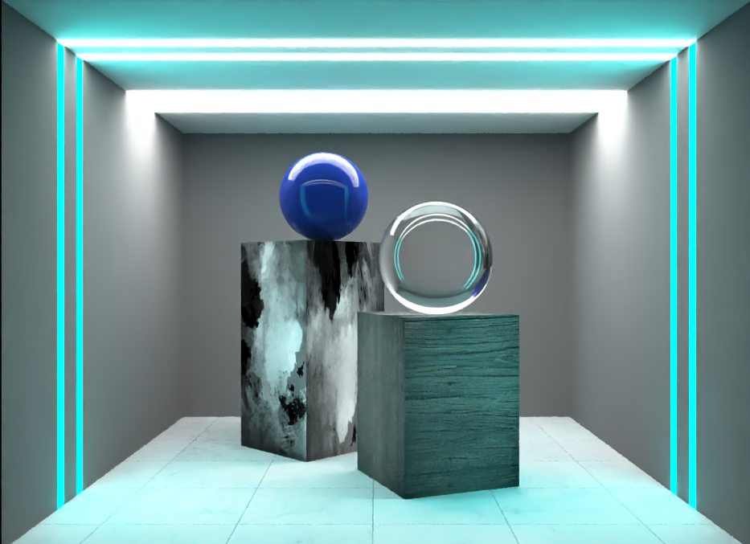
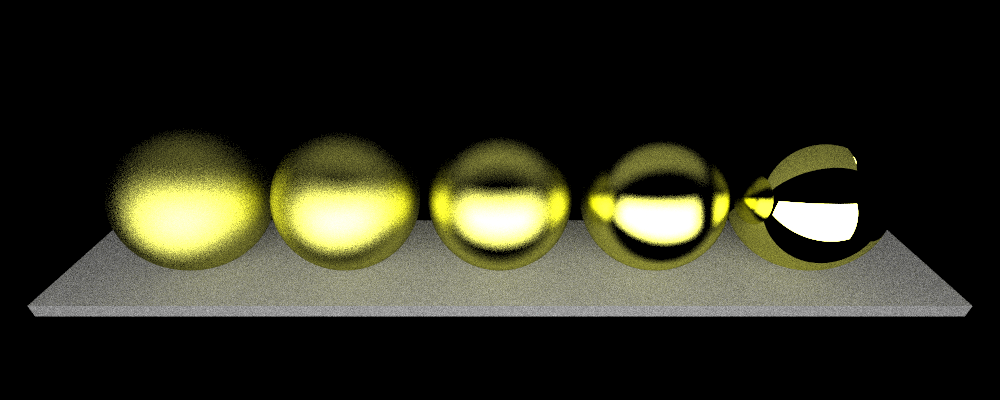
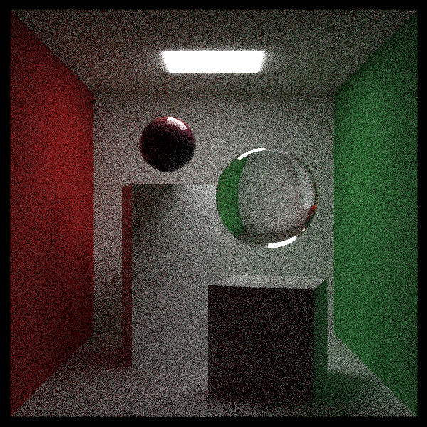

# Ray Tracer from Scratch

  
  
  

This repository contains the implementation of a brute force path tracer in C++. The project avoids the use of libraries and graphics API's (for the core path tracer) and attempts to implement simple physically based rendering effects from scratch. 

## Primitives

  

Ray Surface intersection routine has been implemented for Spheres, Planes, and Boxes; and basic transformations of these primitives. Other effects and features include 

## PBR (*Physically Based Rendering*) Effects 

* Materials 
  * Lambertian (Matte)
  * Lambertian with custom textures 
    * Checkered Texture 
    * Image Texture  
  * Metals
  * Emissive 
  * Dielectrics (Refractive surfaces)
  * Constant Density Mediums (Smoke, etc.)

## Some Other Features

* Motion Blur 
* Antialiasing
* Optimisations 
  * Bounding Volume Heirarchies 
  * Multithreading  
* Depth of Field

## Denoiser 

Noisy Render (Output)             |  Denoised Image
:-------------------------:|:-------------------------:
  |  

Since the application runs on the CPU, samples per pixel needs to be limited to obtain reasonable render times (even with multi-threading). 

The images shown above are denoised using [Intel® Open Image Denoise](https://www.openimagedenoise.org/). The pre-compiled binaries (given in the website) fit right into this repository to call the shell script `denoise`, which manages the whole denoising process and conversions. 

The pre-compiled zip file (unzipped, includes a `bin` and a `lib` folder) needs to be moved into `src/dependancies/`, for the shell script `denoise` to work. 

## Usage

A sample binary has been uploaded with the repo (compiled on x86, as a 64 bit application), but its unlikely that it would generally work even on a system with the same configuration (try anyway, it just might). To compile in a device specific manner, you can create a Makefile using cmake (`CMakeLists.txt` given). 

After creating the Makefile using cmake and making/compiling the project, the compiled binary (`path-tracer`) is to be used with a single command line argument - the name of the scene in `src/scenes.hpp`. (The header file `src/scenes.hpp` contains implementation of all the scenes in this readme file and another scene that does not look as aesthetic.)

    > ./path-tracer CornellBox 

Running this should show a progress bar, after which 3 images will be stored in `output` - the noisy render (Primary output), an albedo image, and a normal map (To aid the denoising process). After these three images have been generated the `denoise` binary can be run in the same way that the main one was 

    > ./denoise CornellBox 

The resolution of the output render and the samples per pixel have been hard-coded in `main.cpp`

## Dependancies and Other Stuff

A simple `OpenMP` call was used to multithread the loop which shoots multiple samples per pixel. The `OpenMP` dependancy is included by the `CmakeLists.txt`, but can easily be removed and worked without. 

The project uses libraries for reading and writing images ([stb_image](https://github.com/nothings/stb) and [FreeImage](https://freeimage.sourceforge.io/)) and for convenience. [GLM](https://github.com/g-truc/glm) was used for mathematical data types (vectors, matrices, etc.) and operations, but can easily be replaced by a few structs. [ImageMagick](https://github.com/ImageMagick/ImageMagick) is also required for commands in the `denoise` shell script.

This project takes a lot from [this](https://www.edx.org/course/computer-graphics-2) course and the repository and code largely takes its structure and features from [this](https://raytracing.github.io/) book series.

